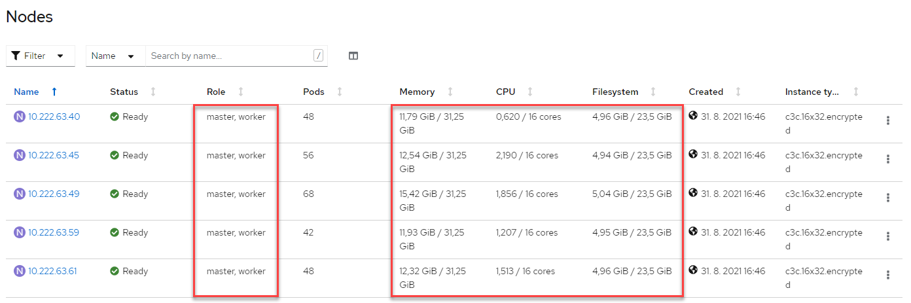

# Installation of Cloud Pak for Business Automation on containers - Demo pattern

This document contains quick notes created during installation of IBM Cloud Pak for Business Automation (CP4BA) using so called _Demo deployment_. The purpose is to demonstrate the procedure and final results. The last installation was performed on September 1, 2021 with CP4BA version 21.0.2-IF001.

These notes have been created using official installation documentation hanging at https://www.ibm.com/docs/en/cloud-paks/cp-biz-automation/21.0.x?topic=kubernetes-installing-demo-deployments. The sections highlighted in red in the screenshot below show the specific sections these notes are based on. There is no major difference. It is just a consolidated one-page description of the installation using Operator Hub, complemented with additional comments.


Two additional methods are available in the documentation - _admin script_ and _silent mode_ (still with manual selection of capabilities) / _deployment script_. They represent valid, partially more automated alternatives. The deployment itself is at the end just piece of yaml. You can experiment on your own.
## Disclaimer
This is not an official IBM documentation. Absolutely no warranties, no responsibility for anything. Use it on your own risk and always follow the official IBM documents.

Please do not hesitate to create an issue here if needed. Your feedback is appreciated.
## OpenShift clusters used for the installation
Two types of OpenShift clusters have been tested, both version 4.7.x:
- ROKS - RedHat OpenShift Kubernetes Service allowing to run managed Red Hat OpenShift on IBM Cloud
- "Home-made" OpenShift cluster created from scratch on top of RHEL and CoreOS virtual machines.

> The installation should behave the same on managed OpenShift clusters like [ROSA (Red Hat OpenShift Service on AWS)](https://aws.amazon.com/rosa/) and [Azure Red Hat OpenShift](https://azure.microsoft.com/services/openshift). Detailed testing is being in progress, with positive results so far. The only major difference actually seems to be in storage classes used for persistent volume claims which provide file systems to store data. The storage classes are always specific for particular environment and vendor. The right selection of storage classes must be performed during the installation.
## Pre-requisites
1) OpenShift cluster sized according with the system requirements: https://www.ibm.com/docs/en/cloud-paks/cp-biz-automation/21.0.x?topic=installation-system-requirements.
1) Software entitlement key available at https://myibm.ibm.com/products-services/containerlibrary
1) Red Hat (RHEL), CentOS, or macOS to run the installation scripts. The scripts will be communication with your OpenShift cluster using OpenShift CLI (oc), resp. kubectl. Detailed instructions are available at https://www.ibm.com/docs/en/cloud-paks/cp-biz-automation/21.0.x?topic=deployments-preparing-demo-deployment.

> The hardware requirements at the link above may look pretty large for demo deployment. In our case we are using OpenShift cluster with 5 nodes running in combined mode as both master and worker. Each with 16 CPU cores, 32 GB RAM and 24 GB disk space. All the resources are far from being heavily utilized. But - only the official system requirements should be respected.


## Types of deployment and available capabilities
Two types of CP4BA deployments are available - _Demo_ and _Enterprise_.
### Demo deployment
- Intended for demonstration and evaluation purposes. Not for production, not even for development.
- Limited set of CP4BA capabilities:
  - IBM Business Automation Workflow - Authoring
  - IBM FileNet Content Manager
  - IBM Operational Decision Manager
  - IBM Automation Decision Services
  - IBM Automation Document Processing
  - IBM Business Automation Insights
  - IBM Business Automation Application
- Simplified pre-requisites making installation easier:
  - Uses bundled containerized DB2 database. No need to take care of creation of a database. All capabilities by default use the shared DB2 with no additional configuration effort.
  - The same for LDAP used by CP4BA's User Management Service (UMS). It is implemented using OpenLDAP. phpLDAPadmin is also automatically installed and configured to make administration of users and groups easier if needed.
- The pre-defined default services like OpenLDAP, phpLDAPadmin, BusyBox, Alpine etc. might have vulnerabilities and are not suitable for production.
- Sets default credentials to make it easy to deploy, and for this reason you must not keep an Demo deployment for development or for production.
### Enterprise deployment
- Intended for project deployments from development to production.
- Completely open to specific configurations depending on environment of the customer - databases, LDAP servers etc.
- Requires more expertise and effort to install.
## Installation procedure
### Preparing for a demo deployment
First you need to have an Red Hat (RHEL), CentOS, or macOS environment allowing you to run the scripts and communicate with the OpenShift cluster.

Follow this link https://www.ibm.com/docs/en/cloud-paks/cp-biz-automation/21.0.x?topic=deployments-preparing-demo-deployment to install Kubernetes/OCP CLI and podman.

Create a temporary directory with whatever name your prefer to keep your artifacts for installation. Let's call the directory _cp4ba-install_.
```
mkdir cp4ba-install
cd cp4ba-install
```

Download the _Container Application Software for Enterprises (CASE)_ package.
```
curl https://github.com/IBM/cloud-pak/raw/master/repo/case/ibm-cp-automation/3.1.2/ibm-cp-automation-3.1.2.tgz -kL -o ibm-cp-automation-3.1.2.tgz
```
Unpack the artifacts.
```
tar -xvzf ibm-cp-automation-3.1.2.tgz
cd ibm-cp-automation/inventory/cp4aOperatorSdk/files/deploy/crs
tar -xvzf cert-k8s-21.0.2.tar
```
### Setting up the cluster for Operator Hub
This part is based on https://www.ibm.com/docs/en/cloud-paks/cp-biz-automation/21.0.x?topic=cluster-setting-up-operator-hub, resp. https://www.ibm.com/docs/en/cloud-paks/cp-biz-automation/21.0.x?topic=hub-preparing-operator-log-file-storage.

Login to your OpenShift cluster.
```
oc login --token=<YOUR_TOKEN> --server=<YOUR_SERVER>
```

Create a new namespace for your project where CP4BA will be installed. Let's call the namespace _cp4ba_. We will use _NAMESPACE_ variable in all the following commands to make them re-usable for other namespace if needed.
```
export NAMESPACE=cp4ba
oc create namespace ${NAMESPACE}
oc project ${NAMESPACE}
```

Now you need to make sure what storage class will be used. It is always specific to your environment - ROKS (e.g. ibmc-file-gold-gid), home-made OCP cluster (e.g. managed-nfs-storage), ROSA etc.
```
cd cert-kubernetes/descriptors
```

> Specific storage class is actually the main difference of the deployment in specific environment.

You can list available storage classes using following command.
```
oc get storageclass
```
Let's say we are on ROKS and the right storage class for the installation is _ibmc-file-gold-gid_.

To create persistent volume claims needed for the deployment, edit the yaml file used for their creation and insert your storage class name into it. So edit the _operator-shared-pvc.yaml_ file using your favorite editor and replace the <StorageClassName> and <Fast_StorageClassName> placeholders by storage classes of your choice.

```
vi operator-shared-pvc.yaml
```

> TODO sed replacement

Apply the yaml file to create the persistent volume claims (PVCs).
```
oc apply -f operator-shared-pvc.yaml
```
You can check for status of the PVCs creation using:
```
oc get pvc
```

You want to see something like below with two PVCs created, with status _Bound_. Creation of PVCs can take couple of minutes on ROKS.
```
# oc get pvc
NAME                  STATUS   VOLUME                                     CAPACITY   ACCESS MODES   STORAGECLASS          AGE
cp4a-shared-log-pvc   Bound    pvc-573ee629-2c53-49c7-9c7a-1a0993ec7708   100Gi      RWX            ibmc-file-gold-gid   4m30s
operator-shared-pvc   Bound    pvc-08b41ff3-2174-4d63-8bc3-4f3903cc493c   1Gi        RWX            ibmc-file-gold-gid   4m30s
```
> **! IMPORTANT !**
Before proceeding further make sure that the PVCs are created and bound.

Get your software entitlement key from https://myibm.ibm.com/products-services/containerlibrary and set it to property _ENTITLEMENT_KEY_ for re-use in the scripts.

```
export ENTITLEMENT_KEY=<YOUR_ENTITLEMENT_KEY>
```

Generate a secret with the name _admin.registrykey_ to pull the catalog images from the IBM Entitled Registry.
```
kubectl create secret docker-registry admin.registrykey -n ${NAMESPACE} \
   --docker-server=cp.icr.io \
   --docker-username=cp \
   --docker-password="${ENTITLEMENT_KEY}"
```

Create one more secret for IBM Business Automation Insights with the name _ibm-entitlement-key_ with your entitlement key for the IBM Entitled Registry.
```
kubectl create secret docker-registry ibm-entitlement-key -n ${NAMESPACE} \
   --docker-username=cp \
   --docker-password="${ENTITLEMENT_KEY}" \
   --docker-server=cp.icr.io
```

Create the _ibm-cp4ba-privileged_ and _ibm-cp4ba-anyuid_ service accounts (SA), and bind the security context constraints (SCC) to control the actions the SA can take and what it can access.

First create the yaml file.
```
cat <<EOF >service-account-for-demo.yaml
apiVersion: v1
kind: ServiceAccount
metadata:
  name: ibm-cp4ba-anyuid
imagePullSecrets:
- name: "admin.registrykey"

---
apiVersion: v1
kind: ServiceAccount
metadata:
  name: ibm-cp4ba-privileged
imagePullSecrets:
- name: "admin.registrykey"
EOF
```
And apply the yaml file just created.
```
oc apply -f service-account-for-demo.yaml -n ${NAMESPACE}
```

Now bind the SCC to these service accounts:
```
oc adm policy add-scc-to-user privileged -z ibm-cp4ba-privileged -n ${NAMESPACE}
oc adm policy add-scc-to-user anyuid -z ibm-cp4ba-anyuid -n ${NAMESPACE}
```
### Installing the capabilities in Operator Hub
This part is based on https://www.ibm.com/docs/en/cloud-paks/cp-biz-automation/21.0.x?topic=hub-installing-operator-catalog.

Add the CatalogSource resources to Operator Hub using yaml file below. The CatalogSource resources add the _IBM Operator Catalog_ to the OperatorHub, which depends on the catalog sources for _IBM Cloud Pak for Business Automation_ and _IBM Automation Foundation Services_.

First, create the yaml file for _IBM Operator Catalog_.
```
cat <<EOF > ibm-operator-catalog.yaml
apiVersion: operators.coreos.com/v1alpha1
kind: CatalogSource
metadata:
  name: ibm-operator-catalog
  namespace: openshift-marketplace
spec:
  displayName: "IBM Operator Catalog"
  publisher: IBM
  sourceType: grpc
  image: docker.io/ibmcom/ibm-operator-catalog
  updateStrategy:
    registryPoll:
      interval: 45m
EOF
```
And apply the yaml file just created.
```
oc apply -f ibm-operator-catalog.yaml
```
Second, create the yaml file for _IBM Automation Foundation Services_.
```
cat <<EOF > opencloud-operators-catalog.yaml
apiVersion: operators.coreos.com/v1alpha1
kind: CatalogSource
metadata:
  name: opencloud-operators
  namespace: openshift-marketplace
spec:
  displayName: IBMCS Operators
  publisher: IBM
  sourceType: grpc
  image: quay.io/opencloudio/ibm-common-service-catalog:latest
  updateStrategy:
    registryPoll:
      interval: 45m
EOF
```
And apply the yaml file just created.
```
oc apply -f opencloud-operators-catalog.yaml
```
In the OpenShift console, click _Operators_ and _OperatorHub_, enter _cp4a_ (or _cp4ba_) in the Filter by keyword box under All items. _IBM Cloud Pak for Business Automation_ operator appears. Click on it.


Pop-up window with detail of the operator appears. You can read the details if interested and click on the blue _Install_ button on the top.


Perform configuration of the operator.

** IMPORTANT **

Make sure you select the right version and select your namespace.
Click Install


Now the operator is being installed. You can click on the _View installed Operators in Namespace <YOUR_NAMESPACE>_.

TODO screenshot - in progress
TODO screenshot - in finished

Optional - Some output should be quickly visible in log of the operator in case you want to check the progress.
```
oc logs -f deployment/ibm-cp4a-operator -c operator
```

Verify the deployment by checking all of the pods are running. - All 8 pods need to be Running. It takes usually couple of minutes.
```
oc get pods
```
Or alternatively with watch refreshing output e.g. every 5 seconds.
```
watch -n 5 oc get pods
```
> **! IMPORTANT !**
> Do not proceed further without al the pods in running and ready state - the _1/1_ in _READY_ column.

Following Operators should be visible in "Installed Operators" (all in the specific namespace):
- IBM Automation Foundation Core
- IBM Automation Foundation
- IBM Cloud Pak foundational services
- IBM Cloud Pak for Business Automation

TODO screenshot

https://www.ibm.com/docs/en/cloud-paks/cp-biz-automation/21.0.x?topic=deployments-installing-demo-deployment
https://www.ibm.com/docs/en/cloud-paks/cp-biz-automation/21.0.x?topic=deployment-installing-capabilities-in-operator-hub

On Red Hat OpenShift Kubernetes Service (ROKS) only, apply the no root squash command for Db2. This may take couple of minutes.
```
oc get no -l node-role.kubernetes.io/worker --no-headers -o name | xargs -I {} \
   -- oc debug {} \
   -- chroot /host sh -c 'grep "^Domain = slnfsv4.coms" /etc/idmapd.conf || ( sed -i "s/.*Domain =.*/Domain = slnfsv4.com/g" /etc/idmapd.conf; nfsidmap -c; rpc.idmapd )'
```

Use the operator instance to apply a custom resource on OpenShift console by clicking _Operators_ > _Installed Operators_ > _IBM Cloud Pak for Business Automation_ > _CP4BA deployment_ tab > _Create ICP4ACluster_ blue button.

TODO screenshot

YAML view

TODO screenshot

Select desired configuration - review the YAML file FYI

Watch the pods appearing - across namespaces, sorted by Created

TODO screenshot

Wait for TODO - Final indication of deployment

# See the result of the installation
All the URLs, usernames and passwords allowing you to access installed capabilities are available in the config map of the deployment.

Look into the access Config map using _OpenShift web console_:
- In the menu on the left side click on _Workloads_ and _ConfigMaps_
- Filter the config maps by name - just type _access_ into the filter
- Click on the _icp4adeploy-cp4ba-access-info_ config map
- Now you can see all the URLs, usernames and passwords providing access to the CP4BA components installed.

TODO screenshot
# Un-installation

> **! WARNING !**
> The instructions below delete also IBM Common Services.

https://www.ibm.com/docs/en/cloud-paks/cp-biz-automation/21.0.x?topic=deployments-uninstalling-capabilities
https://www.ibm.com/docs/en/cpfs?topic=issues-uninstallation-is-not-successful

Personal experience:
- Delete your project - default cp4ba.
- Wait for all pods in the project to be deleted.
- In case the project will not be deleted and remains in terminated stage,  perform following cleanup procedure:
```
bash <(curl -s https://raw.githubusercontent.com/IBM/ibm-common-service-operator/master/common/scripts/force-uninstall.sh) -n ${NAMESPACE} # optional way for specific namespace
bash <(curl -s https://raw.githubusercontent.com/IBM/ibm-common-service-operator/master/common/scripts/force-uninstall.sh) -n common-service # the main way for common services, this namespace not available on demo deployment
bash <(curl -s https://raw.githubusercontent.com/IBM/ibm-common-service-operator/master/common/scripts/force-uninstall.sh) -n ibm-common-services # the main way for common services
```
> Hint: You can download the force-uninstall.sh script and reduce amount of retries in it from the default value which is 30 to like 3 to reduce the execution time.
# Hints and tips
TODO
```
oc whoami --show-console
```

